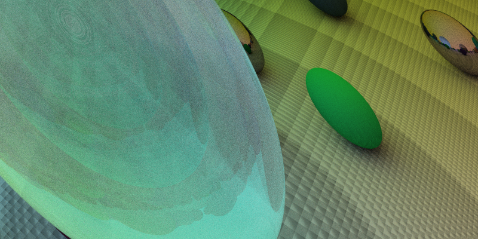

# Ray Tracer

A simple **ray tracer written from scratch in C++**, built to explore the fundamentals of computer graphics and physically-based rendering.

The project is based on concepts from *Ray Tracing in One Weekend* and implements a CPU-based renderer capable of rendering spheres with different materials, reflections, refractions, anti-aliasing, and depth of field.

## Final Render

<p align="center">
  
</p>

## Features

* Ray generation from a virtual camera
* Ray-sphere intersection
* Surface normals
* Diffuse materials
* Metallic materials
* Dielectric / glass materials
* Reflection
* Refraction
* Recursive ray scattering
* Anti-aliasing
* Randomized sampling
* Depth of field
* Adjustable camera parameters
* PPM image output

## Tech Stack

* **C++**
* **C++17**
* **Standard Library**
* **PPM** image format

No external graphics or rendering libraries are required. The renderer generates the image directly on the CPU.

## Project Structure

```text
Ray_tracer/
├── header/
│   ├── camera.h
│   ├── color.h
│   ├── hittable.h
│   ├── hittable_list.h
│   ├── interval.h
│   ├── material.h
│   ├── ray.h
│   ├── sphere.h
│   ├── vec3.h
│   └── ...
│
├── src/
│   ├── ...
│   └── ...
│
├── assets/
│   └── final_render.png
│
├── basic_ppm.cpp
├── image.ppm
└── README.md
```

## How It Works

The renderer follows the basic ray-tracing pipeline:

```text
                 Camera
                    │
                    ▼
              Generate Ray
                    │
                    ▼
          Ray / Object Intersection
                    │
                    ▼
              Hit Detection
                    │
                    ▼
             Surface Normal
                    │
                    ▼
               Material
              /    |     \
             /     |      \
        Diffuse  Metal  Dielectric
             \     |      /
              \    |     /
               ▼   ▼    ▼
            Scatter Ray
                 │
                 ▼
          Recursive Bounce
                 │
                 ▼
          Accumulate Color
                 │
                 ▼
             Pixel Color
                 │
                 ▼
             Image Output
```

For every pixel, one or more rays are generated from the camera into the scene.

When a ray intersects an object, the renderer calculates the intersection point and surface normal. The material at that point determines how the ray behaves.

Reflective and transparent materials can generate additional rays, allowing light to bounce through the scene recursively.

## Materials

### Diffuse

Diffuse materials scatter incoming rays randomly around the surface normal.

This produces the soft, matte appearance of materials such as:

* Walls
* Paper
* Stone
* Unpolished surfaces

### Metal

Metallic surfaces reflect rays according to the reflection direction, with an optional **fuzz factor** controlling how rough the reflection is.

### Dielectric

Dielectric materials simulate transparent objects such as glass.

The renderer handles:

* Refraction
* Reflection
* Index of refraction
* Total internal reflection

## Anti-Aliasing

Multiple rays are sampled for each pixel instead of using a single ray.

```text
             Pixel
        ┌─────────────┐
        │ •  •     •  │
        │    •  •     │
        │ •       •   │
        └─────────────┘
```

The resulting colors are averaged to produce smoother edges and reduce aliasing.

## Depth of Field

The camera supports depth of field by simulating a finite aperture.

Instead of every ray originating from exactly the same point, rays are randomly sampled across the camera's lens.

This produces:

* A focused region
* Blurred foreground/background
* A camera-like photographic effect

## Image Output

The renderer outputs images using the **PPM (Portable Pixmap)** format.

PPM was used because of its simplicity. Pixels can be written directly to a text file without requiring an external image library.

Example:

```text
P3
800 450
255
...
```

The generated PPM image can then be converted to PNG or another image format for easier viewing and sharing.

## Building

Clone the repository:

```bash
git clone https://github.com/Cozy91/Ray_tracer.git
cd Ray_tracer
```

Compile the project:

```bash
g++ -std=c++17 src/*.cpp -Iheader -o raytracer
```

Run the renderer:

```bash
./raytracer
```

If the renderer writes the image to standard output, redirect it to a PPM file:

```bash
./raytracer > image.ppm
```

## Converting PPM to PNG

Using ImageMagick:

```bash
magick image.ppm final_render.png
```

Or:

```bash
magick image.ppm assets/final_render.png
```

## Concepts

This project covers several fundamental computer graphics concepts:

* Vectors
* Vector arithmetic
* Dot products
* Cross products
* Rays
* Ray-object intersection
* Surface normals
* Reflection
* Refraction
* Random sampling
* Anti-aliasing
* Materials
* Recursive ray tracing
* Camera geometry
* Depth of field
* Image generation

## What I Learned

Building the renderer from scratch helped me understand how a basic rendering pipeline works at a lower level rather than relying on an existing graphics engine.

In particular, the project provided practical experience with:

* C++ class design
* Header/source organization
* Mathematical abstractions
* Recursion
* Memory management
* Random number generation
* Debugging complex mathematical code
* Rendering algorithms
* Image formats

## Future Improvements

* [ ] Triangle support
* [ ] OBJ model loading
* [ ] Textures
* [ ] Emissive materials
* [ ] Area lights
* [ ] Bounding Volume Hierarchy (BVH)
* [ ] Multithreaded rendering
* [ ] PNG/JPEG output
* [ ] More advanced camera controls
* [ ] GPU acceleration

## References

This project was inspired by **Ray Tracing in One Weekend** by Peter Shirley.

The book provides a practical introduction to building a ray tracer from scratch and was used as a reference for many of the rendering concepts implemented in this project.

## License

This project is intended primarily for **educational and experimental purposes**.
